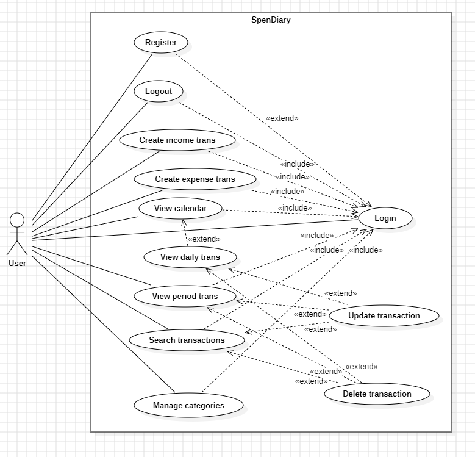
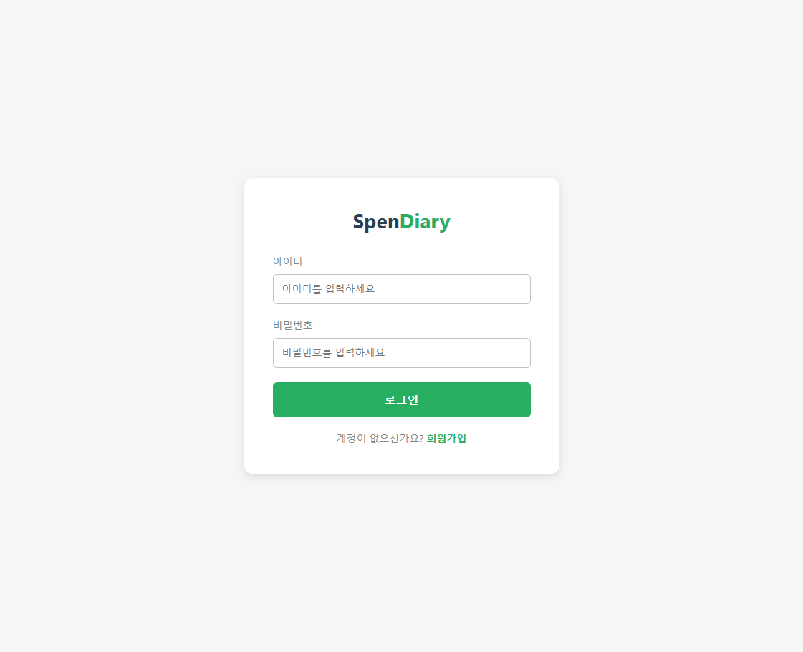
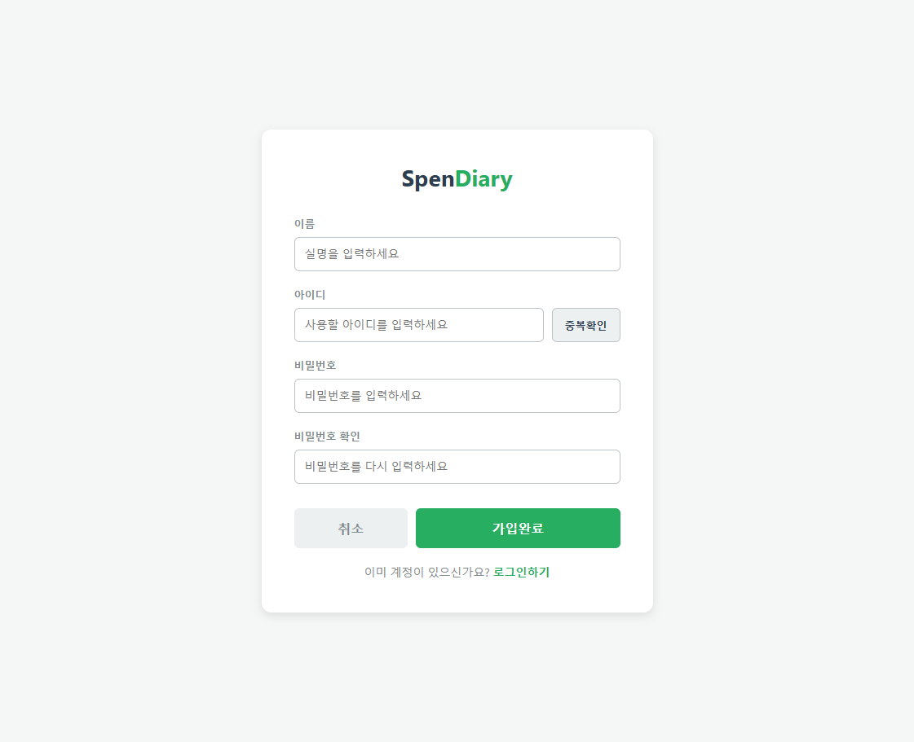
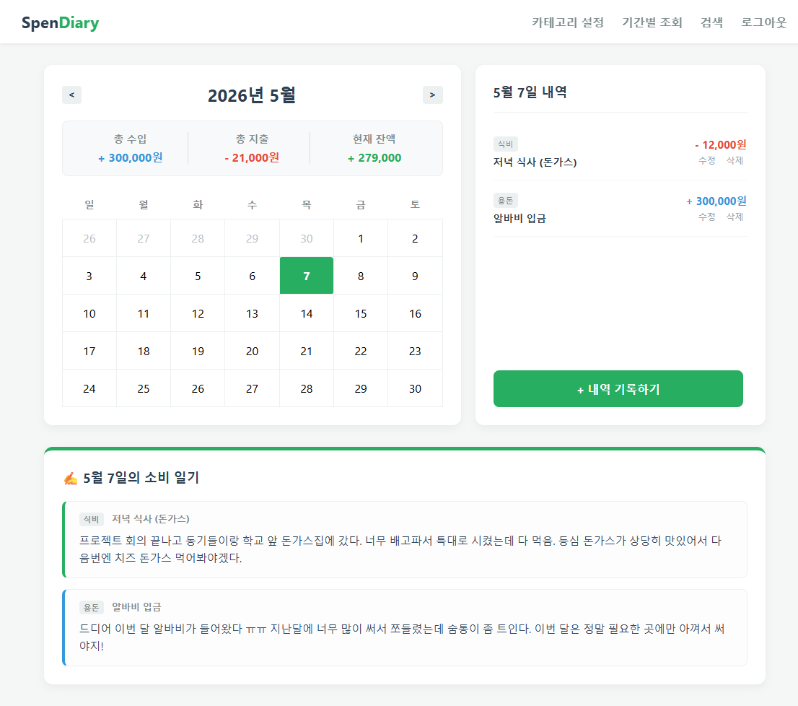
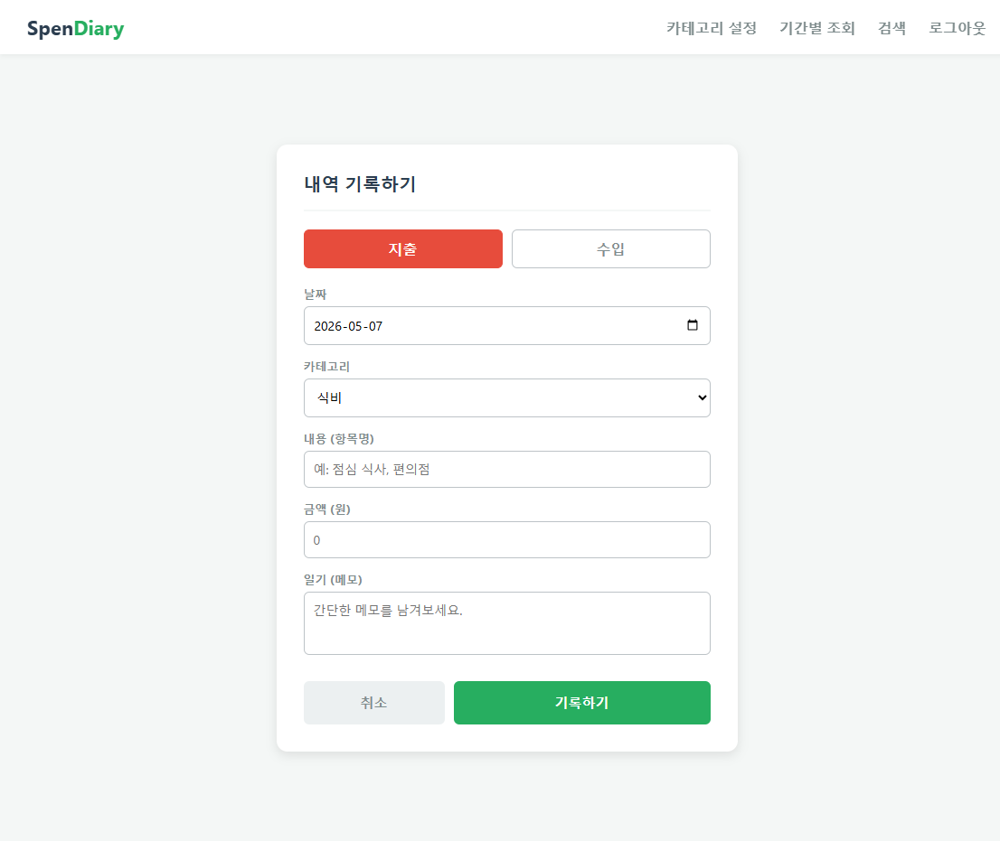
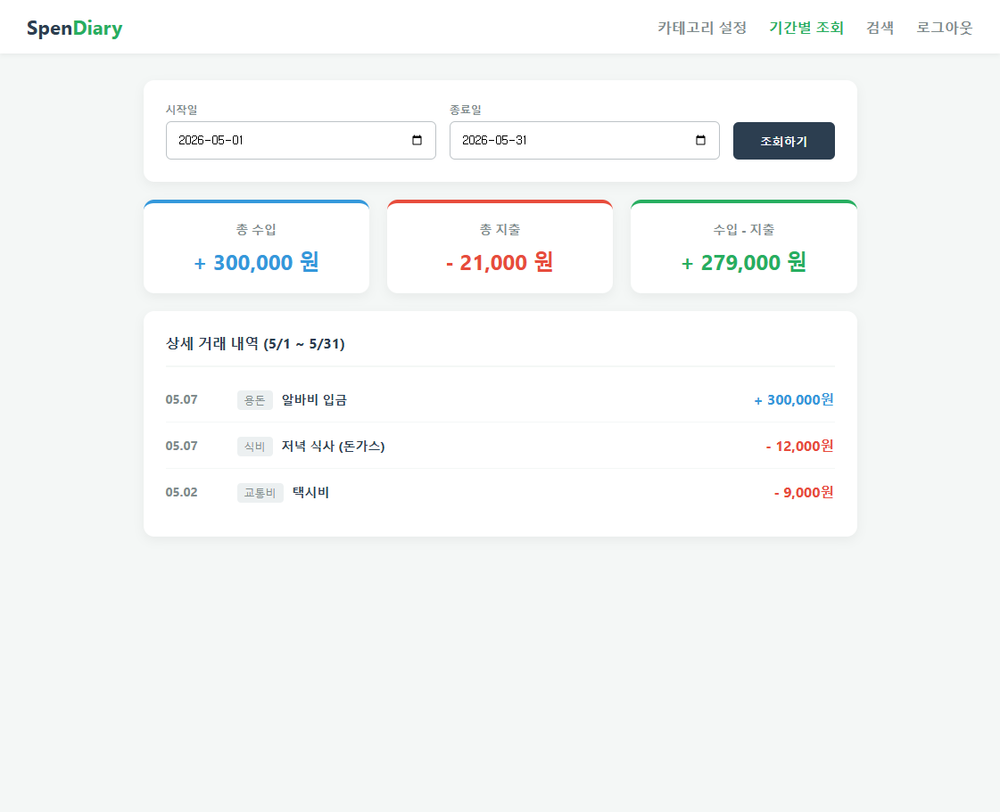
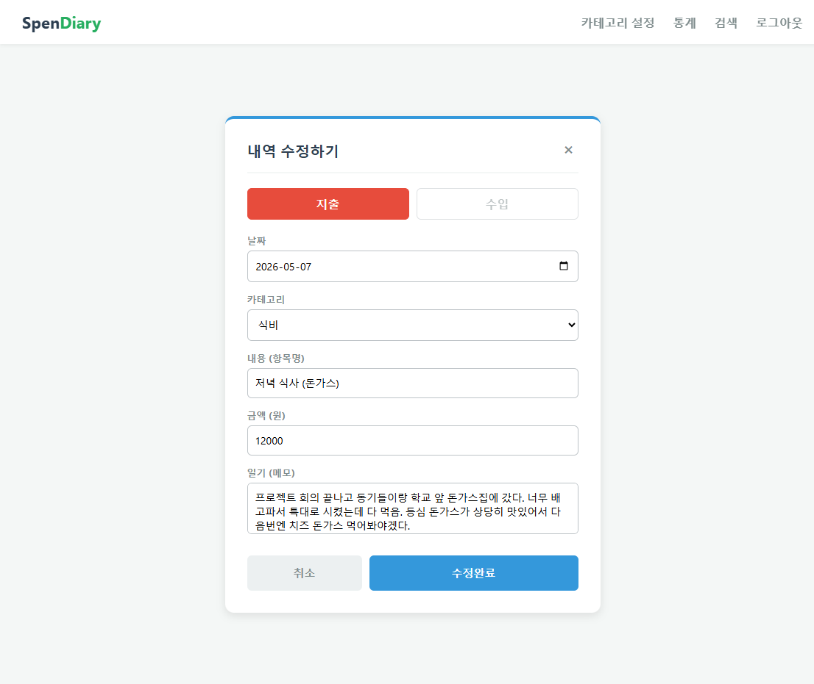
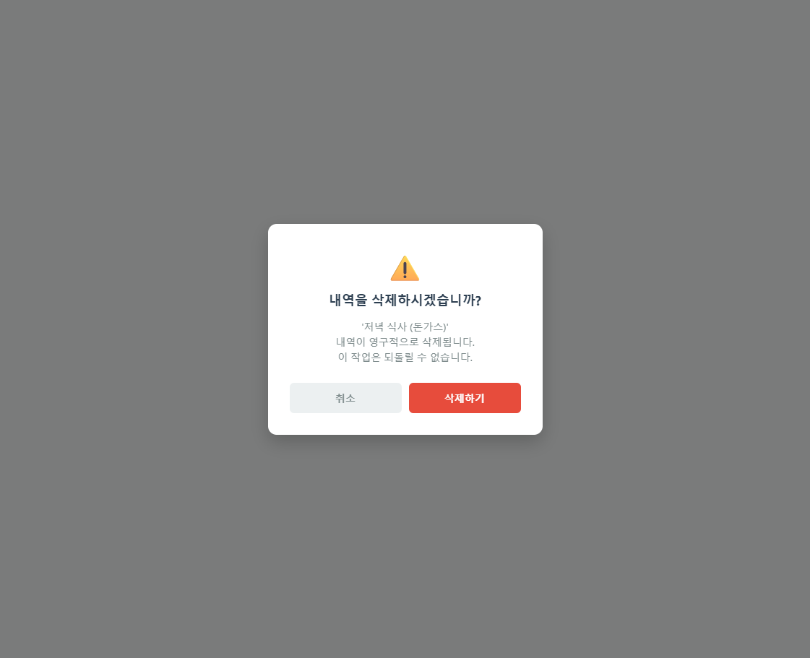
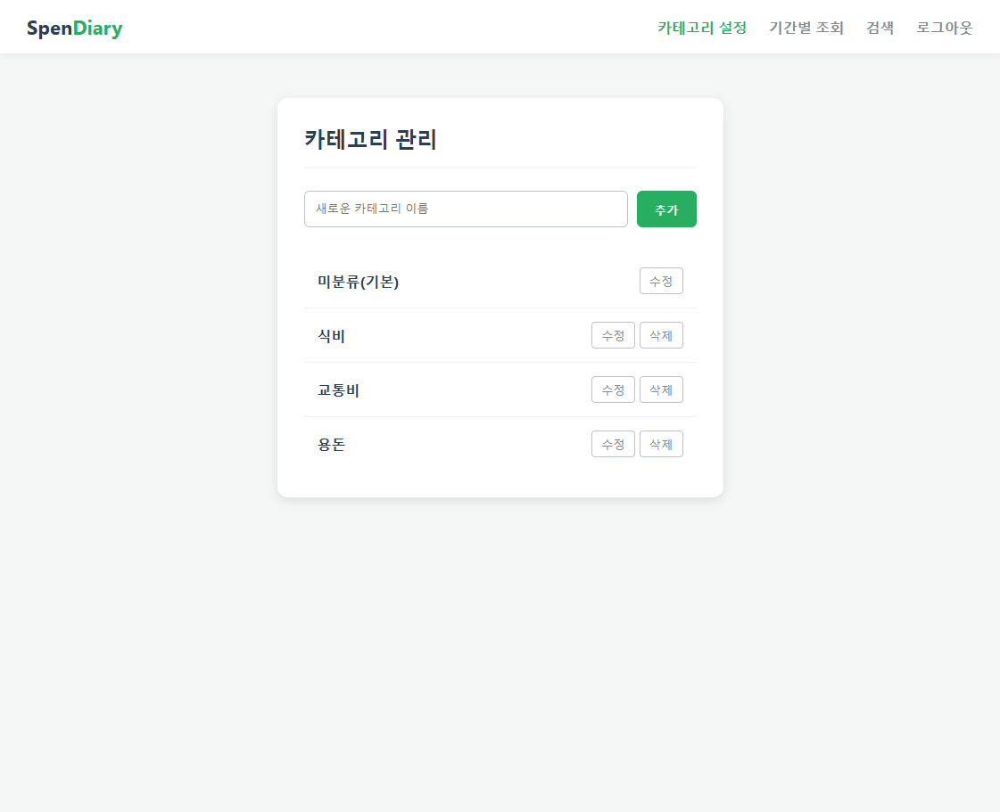
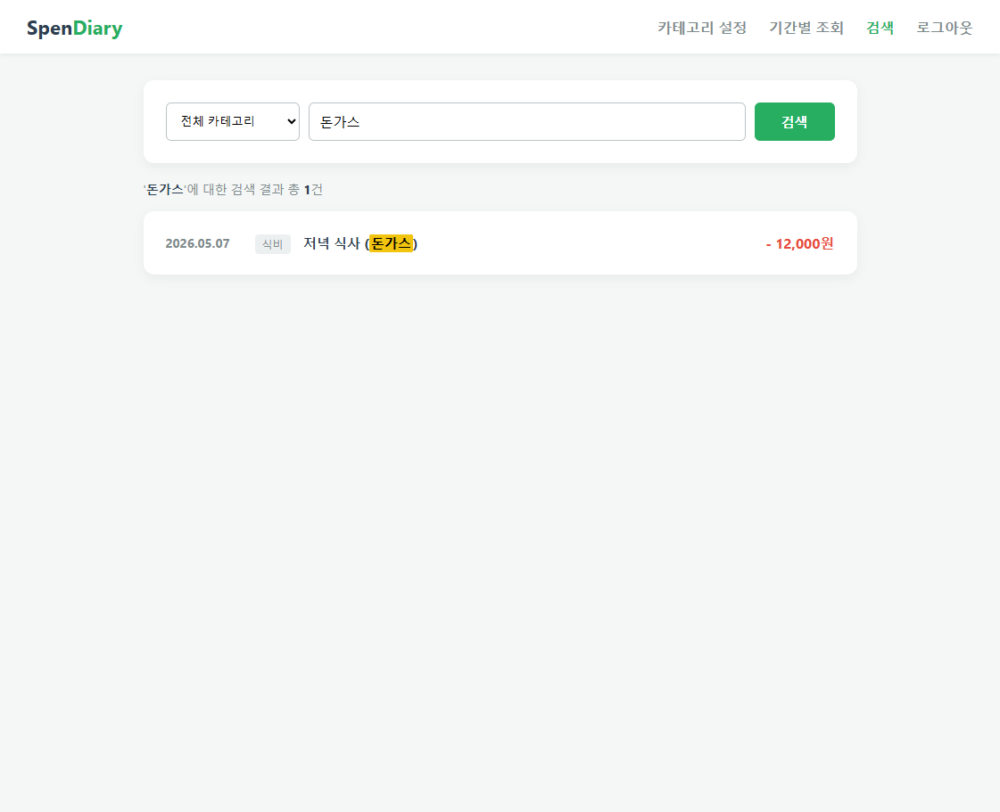

# SpenDiary - Analysis

| Student No | 22212013 |
| :---: | :---: |
| Name | 노현석 |
| E-Mail | nohhyun03@naver.com |

---

## Revision history

| Revision date | Version # | Description | Author |
| :---: | :---: | :--- | :---: |
| 2026-05-07 | 1.0.0 | first draft | Noh HyeonSeok |
| &nbsp; |  |  |  |
| &nbsp; |  |  |  |
| &nbsp; |  |  |  |

---

## Contents

- [Introduction](#1-introduction)
- [Use case analysis](#2-use-case-analysis)
- [Domain analysis](#3-domain-analysis)
- [User Interface prototype](#4-user-interface-prototype)
- [Glossary](#5-glossary)
- [References](#6-references)

---

## 1. Introduction

### 1) Executive Summary
최근 개인의 소비를 기록하고 관리하려는 수요가 증가함에 따라 다양한 가계부 서비스가 등장하고 있다. 하지만 기존의 가계부들은 단순히 수입과 지출 '금액'을 기록하는 데 집중되어 있어, 시간이 지난 후 과거의 기록을 볼 때 “왜” 해당 소비를 했는지 당시의 상황이나 맥락을 떠올리기 어렵다는 한계가 있다.

이러한 문제를 해결하기 위해, 단순한 금전 등록을 넘어 소비의 의미와 맥락을 일기로 남기고 이를 직관적인 달력 기반 UI로 확인할 수 있는 개인 금융 관리 웹 서비스 “SpenDiary”를 기획하게 되었다.

### 2) Business Goals
SpenDiary 시스템의 핵심 목적은 사용자가 자신의 재정 상태를 정확히 기록함과 동시에 소비의 맥락을 저장하여 사용자의 일상을 기록할 수 있도록 하는 것이다. 이를 위해 수입/지출 내역에 일기를 필수 또는 선택적으로 추가할 수 있게 하고, 달력 형태의 인터페이스를 통해 날짜별 소비 흐름과 월별/기간별 요약 정보를 직관적으로 제공하여 사용자가 자신의 소비 패턴을 쉽게 분석할 수 있도록 한다.

### 3) Technical Goals
본 시스템은 Web 환경에서 동작하는 Client-Server 아키텍처로 구성된다.
백엔드 Server는 Java 기반의 Spring Framework를 활용하여 RESTful API를 구축하며, 데이터의 영구적이고 안전한 저장을 위해 관계형 데이터베이스인 MySQL을 사용한다.
개인의 민감한 금융 정보와 사적인 코멘트가 저장되므로, 회원가입 및 로그인을 통한 철저한 인증 체계를 갖춘다. 또한, 사용자가 불편함 없이 시스템을 이용할 수 있도록 데이터 조회 및 검색 시 응답 시간을 최대 3초 이내로 최적화하는 것을 목표로 한다.

[↑ Back to top](#spendiary---analysis)

---

## 2. Use case analysis

### 2.1. Use Case Diagram

### 2.2. Use Case Description

### Use Case #1 : Register
[Interface Prototype : 회원가입 화면 확인하기](#2-register-screen)
#### GENERAL CHARACTERISTICS
| Summary | 사용자가 SpenDiary를 처음 이용하고자 할 때 사용한다. |
| :--- | :--- |
| Scope | SpenDiary |
| Level | User Level |
| Author | Noh HyeonSeok |
| Last Update |  |
| Status | Analysis |
| Primary Actor | User |
| Preconditions | 시스템이 실행되어야 한다. |
| Trigger | 로그인 페이지에서 회원가입 버튼을 눌러 회원가입을 하려고 할 때 |
| Success Post Condition | 사용자는 로그인을 할 수 있다. |
| Failed Post Condition | 사용자는 로그인을 할 수 없다. |

#### MAIN SUCCESS SCENARIO
| Step | Action |
| :---: | :--- |
| 1 | 사용자가 회원가입을 할 때 시작된다. |
| 2 | 사용자는 로그인 페이지에서 회원가입 버튼을 누른다. |
| 3 | 시스템은 회원가입 페이지를 띄운다. |
| 4 | 사용자는 이름과 아이디, 패스워드를 입력하고 가입완료 버튼을 누른다. |
| 5 | 회원가입이 성공하면 끝난다. |

#### EXTENSION SCENARIOS
| Step | Branching Action |
| :---: | :--- |
| 4 | 4a. 중복확인을 누른 경우 &nbsp;&nbsp;4a.1. 이미 사용 중인 아이디라면 사용중이라는 메세지를 띄운다. &nbsp;&nbsp;4a.2. 사용가능한 아이디라면 사용가능이라는 메세지를 띄운다. 4b. 비밀번호와 비밀번호 확인란의 입력이 일치하지 않는 경우 &nbsp;&nbsp;4b.1. 비밀번호가 일치하지 않다는 메세지를 띄운다. 4c. 입력란을 비우고 가입완료 버튼을 누른 경우 &nbsp;&nbsp;4c.1. 입력란을 작성하라는 메세지를 띄운다. 4d. 중복확인을 하지 않고 가입완료 버튼을 누른 경우 &nbsp;&nbsp;4d.1. 중복확인 버튼을 눌러야 한다는 메세지를 띄운다. |

#### RELATED INFORMATION
| Performance | ≦ 3 Seconds |
| :--- | :--- |
| Frequency | Variable |
| Concurrency | None |
| Due Date | |

---

### Use Case #2 : Login
[Interface Prototype : 로그인 화면 확인하기](#1-login-screen)
#### GENERAL CHARACTERISTICS
| Summary | SpenDiary 사용을 위한 회원인증을 받기 위해 사용한다. |
| :--- | :--- |
| Scope | SpenDiary |
| Level | User Level |
| Author | Noh HyeonSeok |
| Last Update |  |
| Status | Analysis |
| Primary Actor | User |
| Preconditions | 사용자가 SpenDiary에 회원 가입한 상태여야 한다. |
| Trigger | SpenDiary에 접속해야 한다. |
| Success Post Condition | 시스템의 모든 기능을 사용할 수 있다. |
| Failed Post Condition | 로그인에 실패하여 기능을 사용할 수 없다. |

#### MAIN SUCCESS SCENARIO
| Step | Action |
| :---: | :--- |
| 1 | 사용자가 로그인을 할 때 시작된다. |
| 2 | 사용자는 로그인 페이지에서 아이디와 비밀번호를 입력한 후 로그인 버튼을 누른다. |
| 3 | 등록된 회원인지 데이터베이스에서 비교를 통해 확인한다. |
| 4 | 비교 결과 등록된 회원이라면 로그인이 성공하게 된다. |
| 5 | 메인화면으로 전환되며 끝이 난다. |

#### EXTENSION SCENARIOS
| Step | Branching Action |
| :---: | :--- |
| 2 | 2a. 입력란을 비우고 로그인 버튼을 누른 경우 &nbsp;&nbsp;2a.1. 입력란을 작성하라는 메세지를 띄운다. |
| 3 | 3a. 등록된 회원이 아닌 경우 &nbsp;&nbsp;3a.1. 아이디 또는 비밀번호를 확인해달라는 메세지를 띄운다. &nbsp;&nbsp;3a.2. 다시 작성하도록 양식을 비운다. |

#### RELATED INFORMATION
| Performance | ≦ 3 Seconds |
| :--- | :--- |
| Frequency | Variable |
| Concurrency | None |
| Due Date | |

---

### Use Case #3 : Logout
[Interface Prototype : 메인 화면 확인하기](#3-main-screen)
#### GENERAL CHARACTERISTICS
| Summary | 로그아웃하기 위해 사용한다. |
| :--- | :--- |
| Scope | SpenDiary |
| Level | User Level |
| Author | Noh HyeonSeok |
| Last Update |  |
| Status | Analysis |
| Primary Actor | User |
| Preconditions | 사용자는 로그인이 되어있는 상태여야 한다. |
| Trigger | 메인화면에서 로그아웃 버튼을 눌렀을 때 |
| Success Post Condition | 사용자는 로그아웃에 성공한다. |
| Failed Post Condition | 사용자는 로그아웃에 실패한다. |

#### MAIN SUCCESS SCENARIO
| Step | Action |
| :---: | :--- |
| 1 | 사용자가 로그아웃을 눌렀을 때 시작된다. |
| 2 | 사용자는 상단 바의 로그아웃 버튼을 누른다. |
| 3 | 로그아웃이 성공하면 로그인 화면으로 전환되며 끝이 난다. |

#### EXTENSION SCENARIOS
| Step | Branching Action |
| :---: | :--- |
| &nbsp; | &nbsp; |

#### RELATED INFORMATION
| Performance | ≦ 3 Seconds |
| :--- | :--- |
| Frequency | Variable |
| Concurrency | None |
| Due Date | |

---

### Use Case #4 : Create income transaction
[Interface Prototype : 수입 등록 화면 확인하기](#4-create-transaction-screen)
#### GENERAL CHARACTERISTICS
| Summary | 사용자가 수입내역을 입력하여 등록한다. |
| :--- | :--- |
| Scope | SpenDiary |
| Level | User Level |
| Author | Noh HyeonSeok |
| Last Update |  |
| Status | Analysis |
| Primary Actor | User |
| Preconditions | 사용자는 로그인된 상태여야 한다. |
| Trigger | 메인화면에서 내역 기록하기 버튼을 눌렀을 때 |
| Success Post Condition | 수입이 등록되어 데이터베이스에 저장된다. |
| Failed Post Condition | 등록 실패하여 데이터베이스에 저장되지 않는다. |

#### MAIN SUCCESS SCENARIO
| Step | Action |
| :---: | :--- |
| 1 | 사용자가 내역 쓰기를 눌렀을 때 시작된다. |
| 2 | 사용자는 메인화면에서 내역 기록하기 버튼을 누른다. |
| 3 | 날짜, 카테고리, 내용, 금액, 일기를 쓸 수 있는 페이지로 이동한다. |
| 4 | 지출/수입 구분에서 수입을 선택하고 나머지 항목들을 모두 입력한 후 기록하기 버튼을 누른다. |
| 5 | 내역 등록에 성공하면 데이터베이스에 저장되고 메인화면으로 복귀한다. |

#### EXTENSION SCENARIOS
| Step | Branching Action |
| :---: | :--- |
| 3 | 3a. 사용자가 취소 버튼을 누른 경우 &nbsp;&nbsp;3a.1. 기록하기를 중단하고 메인화면으로 복귀한다. |
| 4 | 4a. 필수 입력란을 비우고 기록하기 버튼을 누른 경우 &nbsp;&nbsp;4a.1. 입력란을 작성하라는 메세지를 띄운다. |

#### RELATED INFORMATION
| Performance | ≦ 3 Seconds |
| :--- | :--- |
| Frequency | Variable |
| Concurrency | None |
| Due Date | |

---

### Use Case #5 : Create expense transaction
[Interface Prototype : 지출 등록 화면 확인하기](#4-create-transaction-screen)
#### GENERAL CHARACTERISTICS
| Summary | 사용자가 지출내역을 입력하여 등록한다. |
| :--- | :--- |
| Scope | SpenDiary |
| Level | User Level |
| Author | Noh HyeonSeok |
| Last Update |  |
| Status | Analysis |
| Primary Actor | User |
| Preconditions | 사용자는 로그인된 상태여야 한다. |
| Trigger | 메인화면에서 내역 기록하기 버튼을 눌렀을 때 |
| Success Post Condition | 지출이 등록되어 데이터베이스에 저장된다. |
| Failed Post Condition | 등록 실패하여 데이터베이스에 저장되지 않는다. |

#### MAIN SUCCESS SCENARIO
| Step | Action |
| :---: | :--- |
| 1 | 사용자가 내역 쓰기를 눌렀을 때 시작된다. |
| 2 | 사용자는 메인화면에서 내역 기록하기 버튼을 누른다. |
| 3 | 날짜, 카테고리, 내용, 금액, 일기를 쓸 수 있는 페이지로 이동한다. |
| 4 | 지출/수입 구분에서 지출을 선택하고 나머지 항목들을 모두 입력한 후 기록하기 버튼을 누른다. |
| 5 | 내역 등록에 성공하면 데이터베이스에 저장되고 메인화면으로 복귀한다. |

#### EXTENSION SCENARIOS
| Step | Branching Action |
| :---: | :--- |
| 3 | 3a. 사용자가 취소 버튼을 누른 경우 &nbsp;&nbsp;3a.1. 기록하기를 중단하고 메인화면으로 복귀한다. |
| 4 | 4a. 필수 입력란을 비우고 기록하기 버튼을 누른 경우 &nbsp;&nbsp;4a.1. 입력란을 작성하라는 메세지를 띄운다. |

#### RELATED INFORMATION
| Performance | ≦ 3 Seconds |
| :--- | :--- |
| Frequency | Variable |
| Concurrency | None |
| Due Date | |

---

### Use Case #6 : View calendar with monthly summary
[Interface Prototype : 메인 화면 확인하기](#3-main-screen)
#### GENERAL CHARACTERISTICS
| Summary | 사용자가 달력 화면에서 월별 수입 및 지출 요약을 확인한다. |
| :--- | :--- |
| Scope | SpenDiary |
| Level | User Level |
| Author | Noh HyeonSeok |
| Last Update |  |
| Status | Analysis |
| Primary Actor | User |
| Preconditions | 사용자는 로그인된 상태여야 한다. |
| Trigger | 로그인 성공 후 메인화면으로 진입했을 때, 또는 다른 메뉴에서 상단 바의 로고를 클릭하였을 때 |
| Success Post Condition | 해당 월의 달력과 월 총수입/총지출/잔액 금액이 표시된다. |
| Failed Post Condition | 시스템 오류로 데이터를 불러오지 못해 달력 정보가 표시되지 않는다. |

#### MAIN SUCCESS SCENARIO
| Step | Action |
| :---: | :--- |
| 1 | 사용자가 메인화면에 진입할 때 시작된다. |
| 2 | 시스템은 현재 날짜 기준의 월 달력을 띄운다. |
| 3 | 데이터베이스에서 해당 월의 모든 수입/지출 데이터를 조회한다. |
| 4 | 시스템은 달력의 상단에 해당 월 총수입/총지출/잔액 합계를 계산하여 표시한다. |
| 5 | 사용자가 요약 정보를 확인하면 끝난다. |

#### EXTENSION SCENARIOS
| Step | Branching Action |
| :---: | :--- |
| 2 | 2a. 달력의 이전 달/다음 달 버튼을 누른 경우 &nbsp;&nbsp;2a.1. 시스템은 선택한 월의 데이터를 다시 조회하여 변경된 월의 정보를 띄운다. |

#### RELATED INFORMATION
| Performance | ≦ 3 Seconds |
| :--- | :--- |
| Frequency | Variable |
| Concurrency | None |
| Due Date | |

---

### Use Case #7 : View daily transactions by selecting a date
[Interface Prototype : 메인 화면 확인하기](#3-main-screen)
#### GENERAL CHARACTERISTICS
| Summary | 사용자가 달력에서 특정 날짜를 선택하여 해당 날짜의 상세 거래 내역을 조회한다. |
| :--- | :--- |
| Scope | SpenDiary |
| Level | User Level |
| Author | Noh HyeonSeok |
| Last Update |  |
| Status | Analysis |
| Primary Actor | User |
| Preconditions | 사용자는 로그인된 상태이며 메인 달력 화면에 위치해야 한다. |
| Trigger | 달력에서 특정 날짜를 클릭했을 때 |
| Success Post Condition | 선택한 날짜의 상세 수입/지출 리스트가 달력 우측에 표시되고, 해당 날짜의 일기는 화면 하단에 나열되어 표시된다. |
| Failed Post Condition | 해당 날짜의 데이터를 불러오지 못한다. |

#### MAIN SUCCESS SCENARIO
| Step | Action |
| :---: | :--- |
| 1 | 사용자가 달력에서 날짜를 선택할 때 시작된다. |
| 2 | 사용자는 메인 달력 화면에서 원하는 날짜를 클릭한다. |
| 3 | 시스템은 데이터베이스에서 해당 날짜의 수입/지출 상세 내역과 작성된 일기를 조회한다. |
| 4 | 조회된 내역을 시간순으로 정렬하고 수입/지출 상세 내역은 달력 우측에, 일기는 화면 하단에 각각 표시한다. |
| 5 | 사용자가 상세 내역을 확인하면 끝난다. |

#### EXTENSION SCENARIOS
| Step | Branching Action |
| :---: | :--- |
| 3 | 3a. 선택한 날짜에 기록된 내역이 없는 경우 &nbsp;&nbsp;3a.1.빈 목록을 보여준다. |

#### RELATED INFORMATION
| Performance | ≦ 3 Seconds |
| :--- | :--- |
| Frequency | Variable |
| Concurrency | None |
| Due Date | |

---

### Use Case #8 : View transactions for a specific period with summary
[Interface Prototype : 기간별 조회 화면 확인하기](#5-statistic-screen)
#### GENERAL CHARACTERISTICS
| Summary | 사용자가 조회하고자 하는 기간을 설정하여, 그 기간 동안의 거래 내역과 총계 요약 정보를 조회한다. |
| :--- | :--- |
| Scope | SpenDiary |
| Level | User Level |
| Author | Noh HyeonSeok |
| Last Update |  |
| Status | Analysis |
| Primary Actor | User |
| Preconditions | 사용자는 로그인된 상태여야 한다. |
| Trigger | 상단 메뉴바에서 기간별 조회 버튼을 눌렀을 때 |
| Success Post Condition | 설정한 기간 내의 거래 내역 리스트와 총 수입/총지출 합계가 표시된다. |
| Failed Post Condition | 데이터 조회 실패로 정보를 표시하지 못한다. |

#### MAIN SUCCESS SCENARIO
| Step | Action |
| :---: | :--- |
| 1 | 사용자가 기간별 조회를 선택했을 때 시작된다. |
| 2 | 시스템은 조회 기간을 설정할 수 있는 화면(시작일, 종료일 선택)을 띄운다. (기본값은 당월 1일 ~ 현재일) |
| 3 | 사용자는 원하는 시작일과 종료일을 입력하고 조회하기 버튼을 누른다. |
| 4 | 시스템은 데이터베이스에서 해당 기간 내의 수입/지출 데이터를 조회한다. |
| 5 | 조회된 기간의 총수입/총지출 요약 정보와 전체 상세 내역 리스트를 화면에 표시한다. |
| 6 | 사용자가 정보를 확인하면 끝난다. |

#### EXTENSION SCENARIOS
| Step | Branching Action |
| :---: | :--- |
| 3 | 3a. 종료일이 시작일보다 빠른 날짜로 설정된 경우 &nbsp;&nbsp;3a.1. 올바르지 않은 기간 설정이라는 메시지를 띄운다. &nbsp;&nbsp;3a.2. 기간을 다시 설정하도록 유도한다. |
| 4 | 4a. 해당 기간에 데이터가 없는 경우 &nbsp;&nbsp;4a.1. 요약 정보는 0원으로 표시하고, 목록에는 내역이 없음을 표시한다. |

#### RELATED INFORMATION
| Performance | ≦ 3 Seconds |
| :--- | :--- |
| Frequency | Variable |
| Concurrency | None |
| Due Date | |

---

### Use Case #9 : Update transaction
[Interface Prototype : 내역 수정 화면 확인하기](#6-update-transaction-screen)
#### GENERAL CHARACTERISTICS
| Summary | 사용자가 이미 등록된 수입 또는 지출 내역의 내용을 수정한다. |
| :--- | :--- |
| Scope | SpenDiary |
| Level | User Level |
| Author | Noh HyeonSeok |
| Last Update | |
| Status | Analysis |
| Primary Actor | User |
| Preconditions | 사용자는 로그인된 상태이며, 수정하고자 하는 내역이 화면(메인화면, 검색 등)에 표시되어 있어야 한다. |
| Trigger | 특정 내역의 우측에 표시된 수정 버튼을 눌렀을 때 |
| Success Post Condition | 수정된 내용이 데이터베이스에 업데이트되고, 화면에 반영된다. |
| Failed Post Condition | 수정 실패하여 기존 데이터가 유지된다. |

#### MAIN SUCCESS SCENARIO
| Step | Action |
| :---: | :--- |
| 1 | 사용자가 내역 수정을 눌렀을 때 시작된다. |
| 2 | 사용자는 목록에서 수정하고 싶은 항목의 수정 버튼을 누른다. |
| 3 | 시스템은 해당 내역의 기존 데이터(날짜, 구분, 카테고리, 내용, 금액, 일기)가 입력된 수정 페이지를 띄운다. |
| 4 | 사용자는 원하는 항목의 내용을 수정하고 수정 완료 버튼을 누른다. |
| 5 | 시스템은 유효성 검사 후 데이터베이스의 해당 데이터를 업데이트한다. |
| 6 | 업데이트에 성공하면 수정 버튼 클릭 전 화면으로 복귀하며, 갱신된 내용을 표시한다. |

#### EXTENSION SCENARIOS
| Step | Branching Action |
| :---: | :--- |
| 3 | 3a. 사용자가 취소 버튼을 누른 경우 &nbsp;&nbsp;3a.1. 수정을 취소하고 이전 화면으로 복귀한다. |
| 4 | 4a. 입력란을 비우고 수정완료 버튼을 누른 경우 &nbsp;&nbsp;4a.1. 입력란을 작성하라는 메세지를 띄운다. |

---

### Use Case #10 : Delete transaction
[Interface Prototype : 내역 삭제 화면 확인하기](#7-delete-transaction-screen)
#### GENERAL CHARACTERISTICS
| Summary | 사용자가 이미 등록된 수입 또는 지출 내역을 완전히 삭제한다. |
| :--- | :--- |
| Scope | SpenDiary |
| Level | User Level |
| Author | Noh HyeonSeok |
| Last Update |  |
| Status | Analysis |
| Primary Actor | User |
| Preconditions | 사용자는 로그인된 상태이며, 삭제하고자 하는 내역이 화면(메인화면, 검색 등)에 표시되어 있어야 한다. |
| Trigger | 특정 내역의 우측에 표시된 삭제 버튼을 눌렀을 때 |
| Success Post Condition | 해당 내역이 데이터베이스에서 완전히 삭제되고, 화면 목록에서도 사라진다. |
| Failed Post Condition | 삭제 실패하여 기존 데이터가 유지된다. |

#### MAIN SUCCESS SCENARIO
| Step | Action |
| :---: | :--- |
| 1 | 사용자가 내역 삭제를 눌렀을 때 시작된다. |
| 2 | 사용자는 목록에서 삭제하고 싶은 항목의 삭제 버튼을 누른다. |
| 3 | 시스템은 삭제할 것인지 묻는 확인창(팝업)을 띄운다. |
| 4 | 사용자가 확인 버튼을 누른다. |
| 5 | 시스템은 데이터베이스에서 해당 데이터를 삭제한다. |
| 6 | 삭제에 성공하면 화면의 목록을 새로고침하여 해당 내역이 사라진 것을 보여준다. |

#### EXTENSION SCENARIOS
| Step | Branching Action |
| :---: | :--- |
| 4 | 4a. 확인창(팝업)에서 취소 버튼을 누른 경우 &nbsp;&nbsp;4a.1. 데이터를 삭제하지 않고 이전 화면 상태를 유지한다. |

#### RELATED INFORMATION
| Performance | ≦ 3 Seconds |
| :--- | :--- |
| Frequency | Variable |
| Concurrency | None |
| Due Date | |

---

### Use Case #11 : Manage categories
[Interface Prototype : 카테고리 관리 화면 확인하기](#8-manage-category-screen)
#### GENERAL CHARACTERISTICS
| Summary | 사용자가 수입/지출 내역 기록 시 사용할 카테고리를 생성, 수정, 삭제하여 관리한다. |
| :--- | :--- |
| Scope | SpenDiary |
| Level | User Level |
| Author | Noh HyeonSeok |
| Last Update |  |
| Status | Analysis |
| Primary Actor | User |
| Preconditions | 사용자는 로그인된 상태여야 한다. |
| Trigger | 상단 메뉴바에서 카테고리 설정 버튼을 눌렀을 때 |
| Success Post Condition | 카테고리 목록이 사용자의 요구대로 변경(추가/수정/삭제)되어 저장된다. |
| Failed Post Condition | 카테고리 관리 작업이 실패하여 이전 상태가 유지된다. |

#### MAIN SUCCESS SCENARIO
| Step | Action |
| :---: | :--- |
| 1 | 사용자가 카테고리 설정을 눌렀을 때 시작된다. |
| 2 | 시스템은 현재 등록된 카테고리 목록을 보여주는 페이지를 띄운다. |
| 3 | 사용자는 새로운 카테고리 이름을 입력하고 추가 버튼을 누른다. (추가 시) |
| 4 | 시스템은 중복 여부 확인 후 데이터베이스에 새 카테고리를 저장하고 목록을 갱신한다. |
| 5 | 사용자가 원하는 작업을 끝마치고 메인으로 버튼을 누르면 메인화면으로 전환되며 끝난다. |

#### EXTENSION SCENARIOS
| Step | Branching Action |
| :---: | :--- |
| 3 | 3a. 목록에서 특정 카테고리의 우측에 수정 버튼을 누른 경우 &nbsp;&nbsp;3a.1. 기존 카테고리 이름을 수정할 수 있는 팝업창이 뜬다. &nbsp;&nbsp;3a.2. 이름을 변경 한 후 확인 버튼을 눌러 저장한다. 3b. 목록에서 특정 카테고리의 우측에 삭제 버튼을 누른 경우 &nbsp;&nbsp;3b.1. 정말 삭제할 것인지 묻는 팝업창이 띄운다. &nbsp;&nbsp;3b.2. 해당 카테고리에 속한 소비 내역들은 미분류(기본) 카테고리로 변경됨을 안내한다. &nbsp;&nbsp;3b.3. 삭제 완료 후 목록을 갱신한다. |
| 4 | 4a. 이미 존재하는 카테고리 이름을 입력한 경우 &nbsp;&nbsp;4a.1. 중복된 이름이라는 메세지를 띄운다. |

#### RELATED INFORMATION
| Performance | ≦ 3 Seconds |
| :--- | :--- |
| Frequency | Variable |
| Concurrency | None |
| Due Date | |

---

### Use Case #12 : Search transactions
[Interface Prototype : 검색 화면 확인하기](#9-search-screen)
#### GENERAL CHARACTERISTICS
| Summary | 사용자가 특정 조건(내용, 카테고리, 일기 등)을 설정하여 데이터베이스에 저장된 거래 내역을 검색한다. |
| :--- | :--- |
| Scope | SpenDiary |
| Level | User Level |
| Author | Noh HyeonSeok |
| Last Update |  |
| Status | Analysis |
| Primary Actor | User |
| Preconditions | 사용자는 로그인된 상태여야 한다. |
| Trigger | 상단 메뉴바에서 검색 버튼을 눌렀을 때 |
| Success Post Condition | 검색 조건에 부합하는 거래 내역 리스트가 화면에 표시된다. |
| Failed Post Condition | 검색 실패하거나 조건에 맞는 결과가 없다. |

#### MAIN SUCCESS SCENARIO
| Step | Action |
| :---: | :--- |
| 1 | 사용자가 검색을 눌렀을 때 시작된다. |
| 2 | 시스템은 검색어를 입력하고 조건을 설정할 수 있는 검색 화면을 띄운다. |
| 3 | 사용자는 검색어를 입력하고 필요한 조건을 선택한 후 검색 버튼을 누른다. |
| 4 | 시스템은 데이터베이스에서 해당 조건들로 검색을 수행한다. |
| 5 | 검색된 수입/지출 내역 리스트를 결과 화면에 표시한다. |
| 6 | 사용자가 결과를 확인하면 끝난다. |

#### EXTENSION SCENARIOS
| Step | Branching Action |
| :---: | :--- |
| 3 | 3a. 검색어를 입력하지 않고 조건만으로 검색하는 경우 &nbsp;&nbsp;3a.1. 시스템은 설정된 조건에 맞는 모든 내역을 조회하여 화면에 표시한다. |
| 4 | 4a. 검색 조건에 맞는 결과가 없는 경우 &nbsp;&nbsp;4a.1. "검색 결과가 없습니다"라는 메세지를 표시한다. |

#### RELATED INFORMATION
| Performance | ≦ 3 Seconds |
| :--- | :--- |
| Frequency | Variable |
| Concurrency | None |
| Due Date | |

[↑ Back to top](#spendiary---analysis)

---

## 3. Domain analysis

### 1) User
SpenDiary 시스템을 사용하는 회원들의 데이터를 저장하고 관리하는 엔티티 클래스이다. 시스템 내에서 개인 식별의 기준이 되며 이름, 아이디, 비밀번호 정보를 가진다.

### 2) Transaction
사용자가 시스템에 등록한 수입 및 지출 내역 데이터를 저장하는 엔티티 클래스이다. 수입/지출 구분, 금액, 날짜, 일기(코멘트) 등의 정보를 가지며 시스템의 핵심 도메인 역할을 한다.

### 3) Category
사용자가 소비 내역을 체계적으로 분류하기 위해 생성한 카테고리 데이터를 저장하는 엔티티 클래스이다.

### 4) SecurityConfig
시스템의 전반적인 보안과 인증, 인가를 제어하는 클래스이다. 사용자의 로그인 세션과 페이지 접근 권한을 관리한다.

### 5) UserController
사용자로부터 전달받은 회원가입, 회원 정보 조회 등의 요청을 처리하는 제어 모듈이다. 입력된 데이터를 검증하고 DatabaseServer에 저장을 요청한다.

### 6) TransactionController
사용자로부터 전달받은 수입/지출 내역 등록, 수정, 삭제 요청을 전담하여 처리하는 제어 모듈이다. 사용자가 입력한 내역 데이터를 가공하여 DatabaseServer에 업데이트를 요청하고 그 결과를 View로 응답한다.

### 7) CategoryController
사용자로부터 전달받은 카테고리 생성, 이름 변경, 삭제 요청을 처리하는 제어 모듈이다. 관련 데이터를 DatabaseServer에 연동하여 업데이트하고 갱신된 카테고리 목록을 관리한다.

### 8) MainController
사용자가 로그인 후 진입하는 메인화면(달력)이나 기간별 조회 화면에 대한 요청을 처리하는 제어 모듈이다. DatabaseServer에 저장된 Transaction 데이터를 불러와 월별 총수입, 총지출 요약 정보 등을 계산하여 View에 전달한다.

### 9) DatabaseServer
시스템의 저장소(MySQL)에 접근하기 위한 역할을 하는 클래스이다. 각 Controller들의 요청을 받아 엔티티(User, Transaction, Category) 데이터를 저장, 조회, 삭제, 업데이트한다.

[↑ Back to top](#spendiary---analysis)

---

## 4. User Interface prototype

### 1) Login Screen

사용자가 SpenDiary 시스템에 접속하면 가장 먼저 보이는 로그인 화면이다. 가입된 회원이라면 아이디와 비밀번호를 입력 후 로그인 버튼을 누르면 메인 화면(달력)으로 넘어간다. 가입된 회원이 아니라면 하단의 회원가입 링크를 눌러 회원가입 화면으로 넘어갈 수 있다. 아이디나 비밀번호를 입력하지 않으면 안내 메시지를 띄워준다.

[↑ Back to Use Case #2 (Login)](#use-case-2--login)

---

### 2) Register Screen

로그인 화면에서 회원가입을 누르면 다음과 같은 회원가입 화면이 보인다. 사용자는 이름, 사용할 아이디, 비밀번호를 입력해야 한다. 아이디 입력 후 중복확인 버튼을 눌러 사용 가능 여부를 검증받아야 한다. 모든 정보를 입력하고 가입완료 버튼을 누르면 성공 시 로그인 화면으로 이동한다. 회원가입을 취소하고 싶을 때는 취소 버튼을 누르면 다시 로그인 화면으로 돌아간다.

[↑ Back to Use Case #1 (Register)](#use-case-1--register)

---

### 3) Main Screen

로그인에 성공하면 나타나는 시스템의 핵심 대시보드 화면이다. 상단 메뉴바를 통해 다른 기능으로 이동하거나 로그아웃을 할 수 있다. 좌측 달력 상단에는 해당 월의 총 수입, 총 지출, 그리고 현재 잔액이 요약되어 표시된다. 달력에서 특정 날짜를 클릭하면 우측에 해당 일자의 상세 내역 리스트가 나타나며, 내역 우측의 버튼을 통해 수정/삭제를 진행할 수 있다. 화면 하단에는 선택한 날짜에 작성된 일기들이 나열되어 소비의 맥락을 읽을 수 있다. 우측 하단의 내역 기록하기 버튼을 누르면 내역 쓰기 화면으로 넘어간다.

[↑ Back to Use Case #3 (Logout)](#use-case-3--logout)

[↑ Back to Use Case #6 (View calendar with monthly summary)](#use-case-6--view-calendar-with-monthly-summary)

[↑ Back to Use Case #7 (View daily transactions by selecting a date)](#use-case-7--view-daily-transactions-by-selecting-a-date)

---

### 4) Create Transaction Screen

메인 화면에서 내역 기록하기 버튼을 누르면 다음과 같이 내역을 작성할 수 있는 폼 화면이 나온다. 사용자는 수입/지출 구분을 선택한 뒤, 날짜, 카테고리, 내용(항목명), 금액, 그리고 상세한 일기(메모)를 입력할 수 있다. 기록하기 버튼을 누르면 데이터베이스에 저장된 후 메인 화면으로 복귀한다. 기록을 원치 않을 경우 하단의 취소 버튼을 누르면 작성 내용을 폐기하고 메인 화면으로 돌아간다.

[↑ Back to Use Case #4 (Create income transaction)](#use-case-4--create-income-transaction)

[↑ Back to Use Case #5 (Create expense transaction)](#use-case-5--create-expense-transaction)

---

### 5) Statistic Screen

상단 메뉴바에서 통계 버튼을 누르면 나타나는 화면이다. 상단에서 조회하고자 하는 시작일과 종료일을 설정하고 조회하기 버튼을 누르면, 해당 기간 동안의 총 수입, 총 지출, 수입-지출이 요약 카드로 표시된다. 화면 하단에는 설정한 기간 내에 발생한 모든 거래 내역 리스트가 시간순으로 나열된다.

[↑ Back to Use Case #8 (View transactions for a specific period with summary)](#use-case-8--view-transactions-for-a-specific-period-with-summary)

---

### 6) Update Transaction Screen

특정 내역의 수정 버튼을 누르면 나타나는 화면이다. 새로운 내역을 작성하는 화면과 동일하지만, 기존에 입력해두었던 데이터가 미리 채워져 있는 상태로 나타난다. 사용자가 원하는 부분을 변경하고 수정완료 버튼을 누르면 정보가 갱신되며 이전 화면으로 돌아간다.

[↑ Back to Use Case #9 (Update transaction)](#use-case-9--update-transaction)

---

### 7) Delete Transaction Screen

사용자가 특정 내역의 삭제 버튼을 누르면 실수로 삭제하는 것을 방지하기 위해 화면이 어두워지며 중앙에 재확인 팝업이 나타난다. 삭제하려는 항목의 정보를 띄워주며, 삭제하기 버튼을 누르면 영구 삭제 후 목록이 갱신된다. 취소 버튼을 누르면 삭제가 취소되고 팝업창이 닫힌다.

[↑ Back to Use Case #10 (Delete transaction)](#use-case-10--delete-transaction)

---

### 8) Manage Category Screen

상단 메뉴바에서 카테고리 설정 버튼을 누르면 나타나는 화면이다. 사용자는 상단의 입력창에 새로운 카테고리 이름을 적고 추가 버튼을 눌러 자신만의 카테고리를 생성할 수 있다. 하단의 리스트에서는 기존에 등록된 카테고리 목록이 나타나며, 우측의 버튼을 통해 이름을 수정하거나 삭제할 수 있다.

[↑ Back to Use Case #11 (Manage categories)](#use-case-11--manage-categories)

---

### 9) Search Screen

상단 메뉴바에서 검색 버튼을 누르면 나타나는 화면이다. 카테고리를 필터링하거나 검색창에 검색어를 입력한 후 검색 버튼을 누른다. 검색이 완료되면 일치하는 결과의 총 건수를 알려주고 하단에 리스트를 띄워준다. 이때 사용자가 입력한 검색어는 리스트 내에서 하이라이트 처리되어 쉽게 알아볼 수 있다.

[↑ Back to Use Case #12 (Search transactions)](#use-case-12--search-transactions)

[↑ Back to top](#spendiary---analysis)

---

## 5. Glossary

| Terms | Description |
| :--- | :--- |
| User | 시스템을 사용하는 사용자 |
| Transaction | 수입 또는 지출과 관련된 금전 기록 |
| Income | 사용자가 얻은 수입 |
| Expense | 사용자가 사용한 지출 |
| Category | 거래를 분류하기 위한 항목 |
| Main Screen | 날짜별 거래를 확인할 수 있는 달력 형태의 화면 |
| Database | 사용자 및 거래 데이터를 저장하는 데이터 저장소 |

[↑ Back to top](#spendiary---analysis)

---

## 6. References

- Spring Framework Documentation : https://spring.io/projects/spring-framework
- MySQL Documentation : https://dev.mysql.com/doc/
- Project Top Image Created with Gemini AI : https://www.gemini.com
- StarUML : https://staruml.io/

[↑ Back to top](#spendiary---analysis)

---

