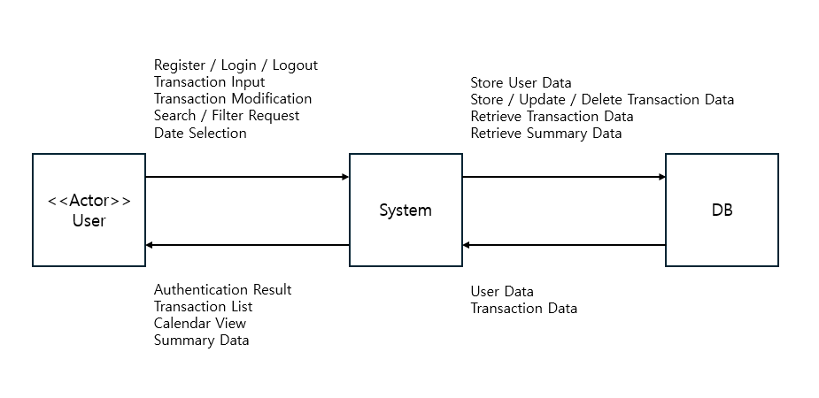

# SpenDiary

| Student No | 22212013 |
| :---: | :---: |
| Name | 노현석 |
| E-Mail | nohhyun03@naver.com |

---

## Revision history

| Revision date | Version # | Description | Author |
| :---: | :---: | :--- | :---: |
| 2026-03-25 | 1.0.0 | first draft | Noh HyeonSeok |
| &nbsp; |  |  |  |
| &nbsp; |  |  |  |
| &nbsp; |  |  |  |

---

## Contents

- [Business Purpose](#1-business-purpose)
- [System Context Diagram](#2-system-context-diagram)
- [Use Case List](#3-use-case-list)
- [Concept of Operation](#4-concept-of-operation)
- [Problem Statement](#5-problem-statement)
- [Glossary](#6-glossary)
- [References](#7-references)

---

## 1. Business Purpose

최근 개인의 소비를 기록하고 관리하려는 수요가 증가하면서 다양한 가계부 서비스들이 등장하고 있다. 많은 사용자들이 자신의 소비 패턴을 파악하고 재정 상태를 관리하기 위해 가계부를 사용하고 있지만, 기존의 가계부는 대부분 수입과 지출 금액을 단순히 기록하는 기능에 집중되어 있다.  

이러한 방식은 숫자 중심의 정보만 제공하기 때문에 사용자가 “왜” 해당 소비를 했는지에 대한 맥락을 파악하기 어렵다는 한계를 가진다. 또한 시간이 지난 후 과거 기록을 확인할 때, 단순한 금액 정보만으로는 당시의 상황이나 활동을 떠올리기 어렵다.  

본 프로젝트는 이러한 문제의식에서 출발하였다. 개인적으로 장기간 가계부를 사용하면서 단순한 소비 기록만으로는 소비의 의미를 충분히 기억하기 어렵다고 느꼈고, 이를 개선할 수 있는 방법에 대해 고민하게 되었다.  

따라서 본 시스템은 수입 및 지출 기록 시 간단한 코멘트를 함께 입력할 수 있도록 하여, 사용자가 소비의 맥락을 함께 기록할 수 있도록 한다. 이를 통해 기존 가계부의 기능에 더해 “기록”의 성격을 일부 포함하는 새로운 형태의 개인 금융 관리 서비스를 제공하는 것을 목표로 한다.  

또한 달력 기반의 사용자 인터페이스를 통해 날짜별 소비 내역을 직관적으로 확인할 수 있도록 하고, 월별 및 기간별 요약 정보를 함께 제공하여 사용자가 자신의 소비 흐름을 한눈에 파악할 수 있도록 한다.  

본 시스템의 주요 목표는 다음과 같다.  

- 수입 및 지출 데이터를 체계적으로 기록하고 관리할 수 있도록 한다  
- 거래 기록에 코멘트를 추가하여 소비의 맥락을 함께 저장할 수 있도록 한다  
- 달력 기반 UI를 통해 날짜별 소비 흐름을 직관적으로 제공한다  
- 기간별 요약 정보를 통해 사용자가 재정 상태를 쉽게 분석할 수 있도록 한다  

본 시스템은 개인적인 재정 관리를 필요로 하는 일반 사용자들을 주요 대상으로 하며, 특히 가계부를 지속적으로 사용하는 사용자나 자신의 소비 패턴을 보다 깊이 있게 이해하고자 하는 사용자들에게 유용하게 활용될 수 있다.

[↑ Back to top](#spendiary)

---

## 2. System Context Diagram

- Register : 회원가입  
- Login : 로그인  
- Logout : 로그아웃  
- Transaction Input : 거래 입력  
- Transaction Modification : 거래 수정/삭제  
- Search / Filter Request : 거래 검색  
- Date Selection : 날짜 선택  
- Authentication Result : 인증 결과  
- Transaction List : 거래 목록  
- Calendar View : 달력 조회  
- Summary Data : 요약 정보  
- Store User Data : 사용자 데이터 저장  
- Store / Update / Delete Transaction Data : 거래 데이터 저장/수정/삭제  
- Retrieve Transaction Data : 거래 데이터 조회  
- Retrieve Summary Data : 요약 데이터 조회  
- User Data : 사용자 데이터  
- Transaction Data : 거래 데이터  

[↑ Back to top](#spendiary)

---

## 3. Use Case List

### 1) Register
| Actor | User |
| :--- | :--- |
| Description | 등록되지 않은 사용자가 계정을 생성한다 |

### 2) Login
| Actor | User |
| :--- | :--- |
| Description | 등록된 사용자가 시스템에 로그인한다 |

### 3) Logout
| Actor | User |
| :--- | :--- |
| Description | 사용자가 로그아웃하여 세션을 종료한다 |

### 4) Create income transaction
| Actor | User |
| :--- | :--- |
| Description | 사용자가 수입 내역을 입력하여 등록한다 |

### 5) Create expense transaction
| Actor | User |
| :--- | :--- |
| Description | 사용자가 지출 내역을 입력하여 등록한다 |

### 6) View calendar with monthly summary
| Actor | User |
| :--- | :--- |
| Description | 사용자가 달력 화면에서 월별 수입 및 지출 요약을 확인한다 |

### 7) View daily transactions by selecting a date
| Actor | User |
| :--- | :--- |
| Description | 사용자가 특정 날짜의 거래 내역을 조회한다 |

### 8) View transactions for a specific period with summary
| Actor | User |
| :--- | :--- |
| Description | 사용자가 기간을 설정하여 거래 내역과 요약 정보를 조회한다 |

### 9) Update transaction
| Actor | User |
| :--- | :--- |
| Description | 사용자가 거래 내역을 수정한다 |

### 10) Delete transaction
| Actor | User |
| :--- | :--- |
| Description | 사용자가 거래 내역을 삭제한다 |

### 11) Manage categories
| Actor | User |
| :--- | :--- |
| Description | 사용자가 카테고리를 생성, 수정, 삭제한다 |

### 12) Search transactions
| Actor | User |
| :--- | :--- |
| Description | 사용자가 조건을 설정하여 거래 내역을 검색한다 |

[↑ Back to top](#spendiary)

---

## 4. Concept of Operation

### 1) Register
| Purpose | 등록되지 않은 사용자가 계정을 생성할 수 있도록 한다 |
| :--- | :--- |
| Approach | 사용자는 회원가입 화면에서 아이디와 비밀번호 등의 정보를 입력하여 계정을 생성한다. 입력된 정보는 서버로 전달되어 데이터베이스에 저장되며, 동일한 아이디는 중복 생성이 불가능하도록 한다 |
| Dynamics | 사용자가 처음 시스템을 이용하고자 할 때 수행된다 |
| Goals | 사용자가 계정을 생성하고 시스템을 이용할 수 있도록 한다 |

### 2) Login
| Purpose | 등록된 사용자인지 확인하고 시스템 접근을 허용한다 |
| :--- | :--- |
| Approach | 사용자는 아이디와 비밀번호를 입력하여 로그인 요청을 하며, 시스템은 데이터베이스의 사용자 정보와 비교하여 인증을 수행한다. 인증 성공 시 세션을 생성하고 기능 사용이 가능하도록 한다 |
| Dynamics | 사용자가 시스템 기능을 이용하고자 할 때 수행된다 |
| Goals | 인증된 사용자에게 개인 데이터 접근 권한을 제공한다 |

### 3) Logout
| Purpose | 사용자의 세션을 종료하여 시스템 접근을 차단한다 |
| :--- | :--- |
| Approach | 사용자가 로그아웃 요청을 하면 서버에서 세션을 종료하고 초기 화면으로 이동한다 |
| Dynamics | 사용자가 시스템 이용을 마치고 종료하고자 할 때 수행된다 |
| Goals | 사용자 인증 상태를 해제하여 보안을 유지한다 |

### 4) Create income transaction
| Purpose | 사용자의 수입 내역을 기록할 수 있도록 한다 |
| :--- | :--- |
| Approach | 사용자는 금액, 카테고리, 날짜, 코멘트를 입력하여 수입 데이터를 등록한다. 입력된 데이터는 서버에 저장되며 이후 조회가 가능하다 |
| Dynamics | 사용자가 수입이 발생했을 때 수행된다 |
| Goals | 수입 내역을 체계적으로 기록할 수 있도록 한다 |

### 5) Create expense transaction
| Purpose | 사용자의 지출 내역을 기록할 수 있도록 한다 |
| :--- | :--- |
| Approach | 사용자는 금액, 카테고리, 날짜, 코멘트를 입력하여 지출 데이터를 등록한다. 입력된 데이터는 서버에 저장되며 이후 조회가 가능하다 |
| Dynamics | 사용자가 지출이 발생했을 때 수행된다 |
| Goals | 지출 내역을 체계적으로 기록할 수 있도록 한다 |

### 6) View calendar with monthly summary
| Purpose | 월 단위의 수입 및 지출 현황을 한눈에 확인할 수 있도록 한다 |
| :--- | :--- |
| Approach | 시스템은 달력 형태의 UI를 제공하며 각 날짜에 간략한 수입 및 지출 정보를 표시한다. 또한 화면 상단에는 해당 월의 총 수입과 총 지출을 함께 제공한다 |
| Dynamics | 사용자가 전체적인 소비 흐름을 확인하고자 할 때 수행된다 |
| Goals | 사용자가 월별 재정 상태를 직관적으로 파악할 수 있도록 한다 |

### 7) View daily transactions by selecting a date
| Purpose | 특정 날짜의 거래 내역을 확인할 수 있도록 한다 |
| :--- | :--- |
| Approach | 사용자가 달력에서 날짜를 선택하면 해당 날짜의 거래 목록과 코멘트를 조회하여 리스트 형태로 출력한다 |
| Dynamics | 사용자가 특정 날짜의 소비 내역을 확인하고자 할 때 수행된다 |
| Goals | 날짜별 소비 기록을 상세하게 확인할 수 있도록 한다 |

### 8) View transactions for a specific period with summary
| Purpose | 특정 기간의 거래 내역과 요약 정보를 제공한다 |
| :--- | :--- |
| Approach | 사용자는 조회 기간을 설정하고 시스템은 해당 기간의 거래 목록을 출력한다. 동시에 상단에 총 수입과 총 지출을 계산하여 함께 표시한다 |
| Dynamics | 사용자가 기간별 소비 패턴을 분석하고자 할 때 수행된다 |
| Goals | 기간 단위의 재정 상태를 파악할 수 있도록 한다 |

### 9) Update transaction
| Purpose | 기존 거래 내역을 수정할 수 있도록 한다 |
| :--- | :--- |
| Approach | 사용자는 기존 거래의 금액, 카테고리, 날짜, 코멘트를 수정할 수 있으며, 수정된 내용은 서버에 반영된다 |
| Dynamics | 사용자가 잘못 입력된 정보를 변경하고자 할 때 수행된다 |
| Goals | 정확한 거래 데이터를 유지할 수 있도록 한다 |

### 10) Delete transaction
| Purpose | 불필요한 거래 내역을 삭제할 수 있도록 한다 |
| :--- | :--- |
| Approach | 사용자가 삭제 요청을 하면 해당 거래 데이터가 데이터베이스에서 제거된다 |
| Dynamics | 사용자가 더 이상 필요 없는 데이터를 제거하고자 할 때 수행된다 |
| Goals | 데이터 관리를 효율적으로 할 수 있도록 한다 |

### 11) Manage categories
| Purpose | 거래를 분류할 수 있는 카테고리를 관리한다 |
| :--- | :--- |
| Approach | 사용자는 카테고리를 생성, 수정, 삭제할 수 있으며, 거래 등록 시 해당 카테고리를 선택하여 사용할 수 있다 |
| Dynamics | 사용자가 분류 기준을 추가하거나 변경하고자 할 때 수행된다 |
| Goals | 거래를 체계적으로 분류할 수 있도록 한다 |

### 12) Search transactions
| Purpose | 원하는 거래 내역을 빠르게 찾을 수 있도록 한다 |
| :--- | :--- |
| Approach | 사용자는 날짜, 카테고리, 키워드 등의 조건을 입력하여 거래를 검색하며, 시스템은 조건에 맞는 결과를 리스트 형태로 제공한다 |
| Dynamics | 사용자가 특정 거래를 찾고자 할 때 수행된다 |
| Goals | 필요한 정보를 효율적으로 탐색할 수 있도록 한다 |

[↑ Back to top](#spendiary)

---

## 5. Problem Statement

### Overview
본 시스템은 사용자의 수입 및 지출을 기록하고 관리하는 개인 금융 관리 웹 서비스이다. 단순한 금액 기록을 넘어 소비의 맥락을 함께 저장하고, 이를 직관적으로 확인할 수 있는 기능을 제공하는 것을 목표로 한다.  

이를 위해 시스템 설계 및 구현 과정에서 고려해야 할 주요 문제는 다음과 같다.

### Problem #1 - Data Accuracy
가계부 시스템에서 가장 중요한 요소는 거래 데이터의 정확성이다. 수입 및 지출 데이터가 잘못 저장되거나 누락될 경우 사용자는 자신의 재정 상태를 잘못 판단할 수 있다. 따라서 모든 거래 데이터는 정확하게 입력되고 안정적으로 저장될 수 있도록 설계해야 한다.

### Problem #2 - Security and Privacy
본 시스템은 사용자의 개인 재정 정보와 코멘트를 함께 저장하기 때문에 개인정보 보호가 매우 중요하다. 인증되지 않은 접근이나 데이터 유출이 발생할 경우 민감한 정보가 노출될 수 있으므로, 사용자 인증과 데이터 보호를 고려한 보안 설계가 필요하다.

### Problem #3 - User Interface and Usability
웹 기반 시스템은 다양한 사용자 환경에서 사용되므로 직관적인 사용자 인터페이스가 매우 중요하다. UI가 복잡하거나 사용성이 떨어질 경우 사용자는 기능을 제대로 활용하기 어렵다. 따라서 달력 UI, 요약 정보, 거래 리스트 구성 등 사용자 경험을 고려한 설계가 필요하다.

### Problem #4 - Data Scalability and Performance
거래 데이터가 지속적으로 누적됨에 따라 조회 및 검색 성능 저하가 발생할 수 있다. 특히 기간별 조회나 검색 기능에서 많은 데이터가 처리되므로 효율적인 데이터 구조와 쿼리 설계가 필요하다.

### Problem #5 - Technical Capability and Learning Curve
본 프로젝트는 웹 기반 서비스로 구현되며, 현재 개발자는 자바 언어 중심의 지식을 보유하고 있다. 따라서 Spring Framework, 데이터베이스, 웹 기술 등 새로운 기술을 학습하며 개발을 진행해야 하며, 이에 따른 학습 곡선과 구현 난이도를 고려한 현실적인 설계가 필요하다.

### Non-Functional Requirements (NFRs)

1. 웹 기반 시스템으로, 주요 웹 브라우저(Chrome, Edge 등)에서 정상적으로 동작해야 한다.
2. 백엔드는 Java 기반의 Spring Framework를 사용하여 구현한다.  
3. 데이터베이스는 관계형 데이터베이스(MySQL)를 사용하여 데이터를 저장한다.  
4. 사용자의 요청에 대한 응답 시간은 일반적인 조회 기준 최대 3초 이내로 처리되어야 한다. 

[↑ Back to top](#spendiary)

---

## 6. Glossary

| Terms | Description |
| :--- | :--- |
| User | 시스템을 사용하는 사용자 |
| System | 개인 금융 관리 웹 애플리케이션 (Spendiary) |
| Transaction | 수입 또는 지출과 관련된 금전 기록 |
| Income | 사용자가 얻은 수입 |
| Expense | 사용자가 사용한 지출 |
| Category | 거래를 분류하기 위한 항목 |
| Comment | 거래와 함께 기록하는 간단한 메모 |
| Calendar View | 날짜별 거래를 확인할 수 있는 달력 형태의 화면 |
| Summary Data | 총 수입 및 지출과 같은 요약 정보 |
| Database | 사용자 및 거래 데이터를 저장하는 데이터 저장소 |

[↑ Back to top](#spendiary)

---

## 7. References

- Spring Framework Documentation : https://spring.io/projects/spring-framework  
- MySQL Documentation : https://dev.mysql.com/doc/
- Project Top Image Created with Gemini AI : https://www.gemini.com

[↑ Back to top](#spendiary)

---

